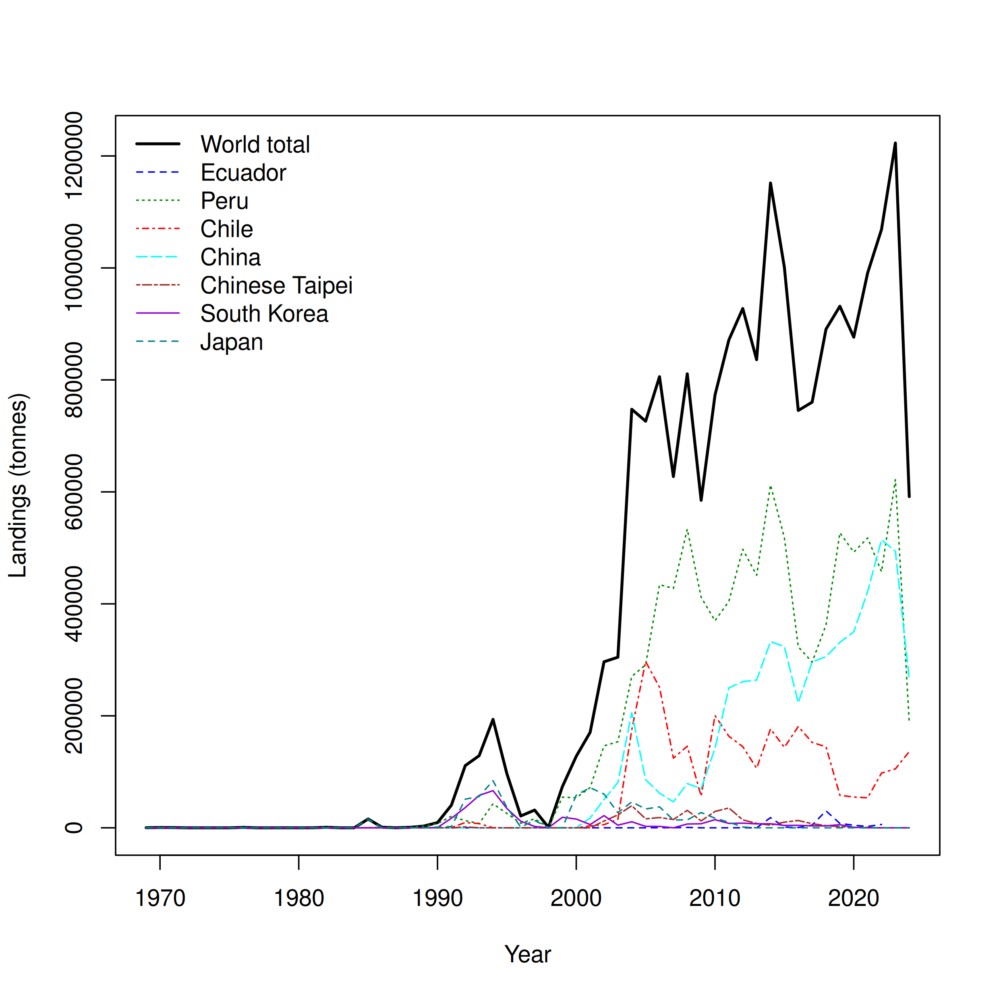
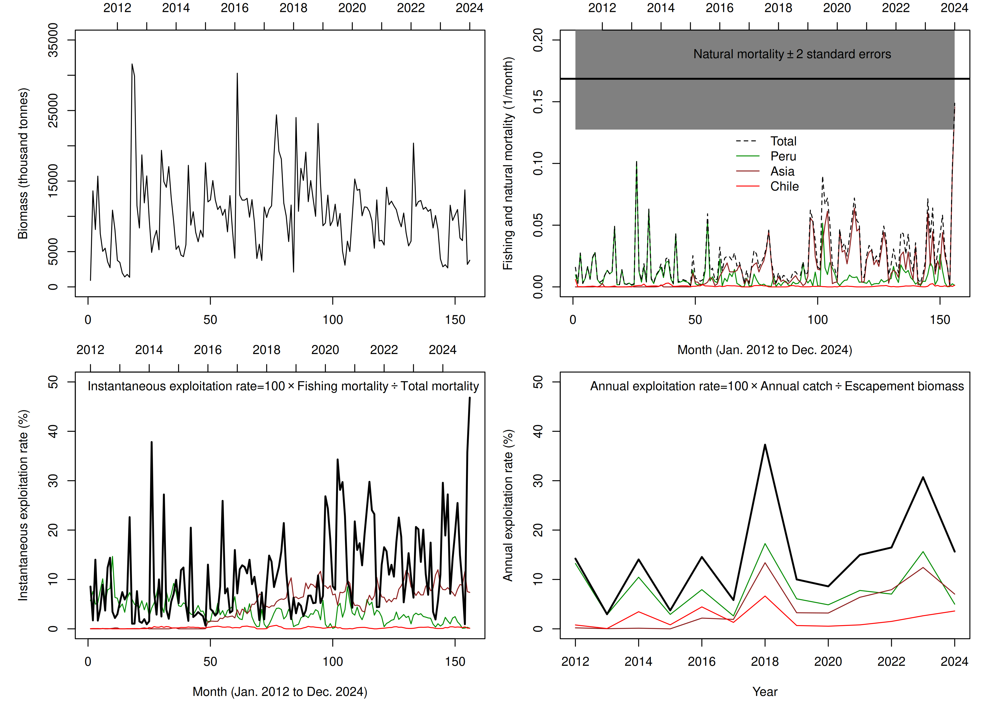
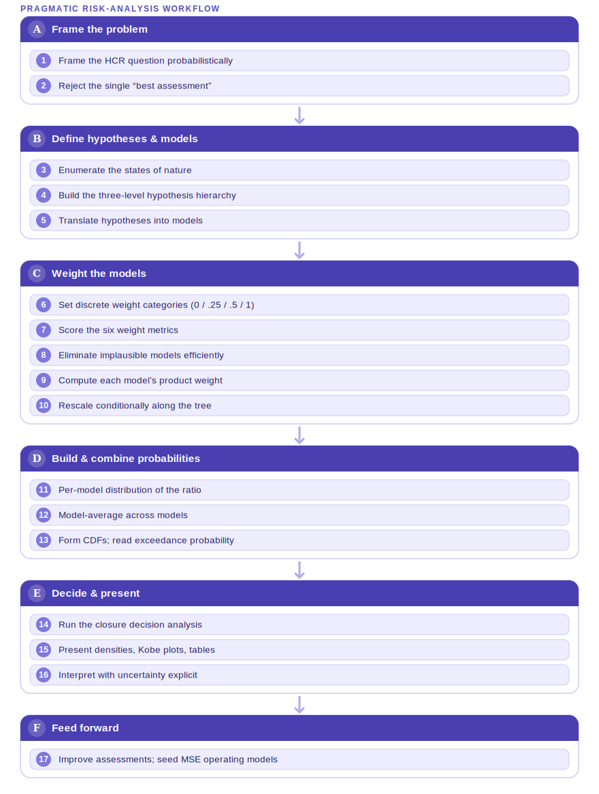

::: {.content-visible when-format="typst"}
**DOI:** [](https://doi.org/)
:::

# Introduction {#sec-intro}

The jumbo flying squid (*Dosidicus gigas*) supports the world's largest invertebrate fishery — over one million tonnes in recent years, the fifteenth largest of all fisheries — prosecuted by a multinational jigging fleet distributed across the Eastern Pacific from Central America to southern Chile [@Rosa2013DosidicusGH]. The species is endemic to the Eastern Pacific, with fishing grounds concentrated off Peru (2–10°S) and on the high seas off Peru (3–18°S) and Central America (5–10°N), and it has undergone a recent poleward range expansion (Waluda & Rodhouse 2005; @Rosa2013DosidicusGH). Habitat-modelling studies show that suitable habitat expands during spring–autumn and contracts sharply in winter off Peru, with catch-per-unit-effort (CPUE) closely tracking habitat suitability [@Yu2019]. Its short, semelparous life cycle, fast growth, and strong sensitivity to environmental variation — particularly the El Niño–Southern Oscillation (ENSO) — make it both economically important and unusually difficult to assess [@Gilly2006; @Ibez2016].

The fishery is managed within the South Pacific Regional Fisheries Management Organisation (SPRFMO). Current conservation and management measures rely on effort- and capacity-based controls (vessel-number and gross-tonnage caps). However, jigging efficiency is strongly environment-driven — modulated by upwelling, sea-surface temperature, and ENSO phase — so capping the size of the fleet does not translate directly into a cap on fishing pressure [@Yu2018; @Fang2023]. This motivates complementary catch-based, environment-aware measures.

A more immediate obstacle to management advice is that the science itself does not speak with one voice. Three SPRFMO parties presented stock assessments for jumbo flying squid to the 13th meeting of the SPRFMO Scientific Committee (SC13; 8–13 September 2025, Wellington, New Zealand). Although all three assess the same species, the same region (South-East Pacific / FAO Area 87), and broadly the same catch data updated to 2024 — including a sharp \~52% drop in landings in 2024 — they reach different verdicts on stock status. The divergence comes almost entirely from model architecture and from how each model treats the 2024 catch decline and environmental variability, not from the underlying data. Point estimates from any single "best" model cannot express the resulting uncertainty, and picking one model discards defensible alternatives.

This working paper synthesises the three competing assessments, explains why they disagree, and presents a probabilistic multi-model risk-analysis framework — adapted from the reference-point-based approach developed for tropical tunas by the Inter-American Tropical Tuna Commission (IATTC) [@maunder2020riskframework; @airesdasilva2020riskanalysis] — as a route to reconcile them and produce management-relevant probability statements for jumbo flying squid.

# The three SPRFMO assessments {#sec-models}

All three assessments share the same catch history to 2024, including the 2024 landings decline (@fig-landings), and the same broad understanding that the stock is strongly modulated by the ENSO cycle. They differ in model family, estimation paradigm, time step, use of fishing effort, and how — if at all — the environment enters the population dynamics.

{#fig-landings width="90%"}

## CALAMASUR — two-stage environment-driven depletion + production model {#sec-calamasur}

The CALAMASUR assessment [@roaureta2025calamasur], presented as observer paper SC13-Obs03, is the most mechanistic of the three. It is a two-stage, environment-driven approach spanning 1990–2024. Stage 1 fits multi-annual, multi-fleet generalized depletion models to a monthly database (January 2012–December 2024) of total catch, fishing effort, and mean weight for three fleets (Peruvian, Chilean, Asian), covering \>99% of regional landings. Stage 2 then drives a Pella-Tomlinson surplus-production model with El Niño/La Niña transitions (NOAA's Oceanic Niño Index; 10 transitions over 1990–2024), testing 16 hypotheses about how carrying capacity, production symmetry, and intrinsic growth rate change with the environment.

Crucially, the depletion stage is effort-driven rather than CPUE-driven, so the assessment does not rely on a standardized CPUE series as an index of abundance — an assumption widely questioned for fast-growing, highly migratory squid. Natural mortality is estimated *inside* the model at ≈0.17/month (≈2.0/yr), consistent with the species' short life cycle. The best-supported environmental hypothesis is that only the intrinsic growth rate *r* varies with the environment — higher in El Niño (2.93/yr) than in La Niña (0.48/yr). The compiled ADMB production model (a two-regime Pella-Tomlinson fit) estimates a carrying capacity K ≈ 10.85 million tonnes and a shape parameter *p* ≈ 1.97. <!-- marlikptdgsep2regp4p -->

The estimated biomass fluctuates widely (maxima an order of magnitude above minima) but shows no sustained downward trend, with the highest peaks before 2019; exploitation rates have risen since 2020 but remain mostly below 40% (@fig-biomass). The main conclusion is that the stock is not overfished, though it may be undergoing overfishing. Because the stock has entered a regime of strong environment-driven fluctuations, MSY and B~MSY~ are judged inadequate reference points, a standard Kobe plot cannot be built, and estimates of sustainable harvest rates (mean latent productivity) remain statistically imprecise.

{#fig-biomass width="90%"}

## Chile (IFOP) — SPiCT surplus-production model {#sec-spict}

The Chilean assessment [@paya2025spict], presented as SC13-SQ06, applies the Stochastic Production model in Continuous Time (SPiCT) — a state-space Pella-Tomlinson surplus-production model that separates process from observation error and can be run at monthly/quarterly steps — to *D. gigas* in FAO Area 87. Its main advance over previous assessments is the use of data up to 2024, reducing the two-year lag of earlier work. Six country CPUE indices were compiled (two Chinese fleet indices, Chinese Taipei, Korea, Chile, Peru), and a sensitivity analysis of seven cases tested a single global index versus six country indices, a fixed Schaefer curve, and a prior on *r*, over two data spans (2001–2024 and 2012–2024).

Catch fell by \~52% in 2024, and the abundance indices show a general decreasing trend. MSY converges around \~950 kt (906–950 kt across cases). The 2025 status is uncertain — of seven cases, four fell in the Kobe red zone, one yellow, two green — but the cases fitted to the six country indices, and in particular Case 7 (free productivity curve, six indices, *r* prior) with the best retrospective pattern, place the 2025 stock in the Kobe red zone, with a 2026 TAC of \~467 kt (comparable to the 2024 catch). TAC advice under F~MSY~ ranged widely, from 267 kt to 989 kt across cases. This is a notable contrast with the "healthy" 2022 status discussed in 2024, and the reversal is driven by a 52% catch drop and declining indices. The authors caution that SPiCT assumes indices are unbiased indicators of the whole stock, and recommend standardising CPUE and accounting for the three *D. gigas* phenotypes and environmentally driven variability.

## China (Shanghai Ocean University) — Bayesian state-space model with ENSO {#sec-china}

The Chinese assessment [@li2025china], presented as SC13-SQ07, is a Bayesian state-space surplus-production (Pella-Tomlinson) model fitted in WinBUGS via MCMC, with an explicit test of how the ENSO cycle affects population dynamics. Four abundance indices were used: Peruvian and Chilean CPUE from CALAMASUR, plus the Chinese squid-jigging CPUE standardized with a Generalized Additive Model (GAM) using environmental covariates (SST, chlorophyll-*a*, salinity, Niño 1+2) and spatiotemporal terms. Seven environment-dependent models were tested, letting carrying capacity *K*, growth rate *r*, and shape *s* vary between El Niño and La Niña phases.

The GAM confirmed year, month, and salinity as the main CPUE drivers, with standardized CPUE peaking in 2015 and lowest in 2024. Among the seven models, the "Kr" model (both *K* and *r* vary with ENSO) had the lowest DIC and was best supported. Base-scenario MSY ≈ 1.19–1.35 Mt (traditional model), rising to \~1.3–1.6 Mt under the environment-dependent model. Kobe diagnostics indicate the stock has been sustainable since 2013 — neither overfished nor undergoing overfishing — with a terminal-year probability of healthy status of 70.9–88.3% under the environment-dependent model (58.6–73.1% under the traditional one). Notably, despite the sharp 2024 landings decline, the stock stayed healthy, a pattern the authors attribute to El Niño's influence on population dynamics rather than to depletion.

# Model comparison: why the three assessments disagree {#sec-comparison}

@tbl-comparison summarises the three approaches. The single biggest structural difference is the two-stage depletion approach it uses: Chile and China both fit a surplus-production model directly to catch and a CPUE abundance index, inferring biomass from the relationship between catch and a relative abundance signal, whereas CALAMASUR first fits an effort-driven depletion model and feeds its biomass series into a production model. This matters because production models assume the CPUE index is proportional to true abundance — questionable for this species — while the depletion design avoids that reliance and estimates *M* internally.

| Dimension | Chile — SPiCT [@paya2025spict] | China — Bayesian state-space [@li2025china] | CALAMASUR — Depletion + Pella-Tomlinson [@roaureta2025calamasur] |
|------------------|------------------|------------------|------------------|
| Model family | Surplus production (Pella-Tomlinson), **continuous time**, state-space | Surplus production (Pella-Tomlinson), **discrete/annual**, state-space | **Two-stage**: monthly *depletion* → Pella-Tomlinson production |
| Estimation | Maximum likelihood (TMB) | Bayesian MCMC (WinBUGS) | Non-Bayesian hierarchical (ADMB) |
| Time step | Continuous | Annual | Stage 1 monthly; Stage 2 annual |
| Data used | Catch + 6 country CPUE indices | Catch + 4 fleet indices | Monthly catch, **effort** & mean weight (3 fleets) + FAO landings |
| Uses fishing **effort**? | No (index-based) | No (index-based) | **Yes** — depletion is effort-driven |
| Environment in model | Not explicit (caveat) | **Explicit** — K, r, s vary by ENSO; 7 models | **Explicit** — r varies by El Niño/La Niña; 16 hypotheses |
| Time span | 2001–2024 (and 2012–2024) | 2012–2024 | 2012–2024 (Stage 1); 1990–2024 (Stage 2) |
| Terminal verdict | Kobe **red zone** (best case) | **Healthy** since 2013 (71–88% prob.) | **Not overfished**, possibly overfishing |

: Comparative overview of the three SPRFMO jumbo squid assessments. {#tbl-comparison}

The three models also differ in how the environment enters. China and CALAMASUR build the ENSO cycle *into* the model, letting productivity switch between regimes — China favouring both *K* and *r* varying, CALAMASUR finding support for only *r* varying (@fig-enso). Chile's SPiCT does not encode the environment explicitly, flagging it instead as a caveat.

```{r}
#| label: fig-enso
#| echo: false
#| message: false
#| warning: false
#| dev: ragg_png
#| fig-cap: "El Niño–Southern Oscillation signal over the assessment period, shown as the annual mean of the Índice Costero El Niño (ICEN; monthly data 2012–2024). The shaded background classifies each year into an ENSO regime using the standard ±0.5 thresholds (El Niño ≥ 0.5, La Niña ≤ −0.5, Neutral between; dashed lines). The China and CALAMASUR models let population productivity parameters switch between these El Niño and La Niña phases."
library(readr)
library(dplyr)
library(ggplot2)

icen <- read_csv("data/ICEN_2024.csv", show_col_types = FALSE)
names(icen) <- c("Year", "Month", "ICEN")

# Locale-safe labels: ñ always parses to UTF-8 "ñ" regardless of the R locale
nt <- intToUtf8(241L) # n-tilde (U+00F1), built locale-independently
el_nino <- paste0("El Ni", nt, "o")
la_nina <- paste0("La Ni", nt, "a")

ann <- icen |>
  filter(!is.na(Year), !is.na(ICEN)) |>
  group_by(Year) |>
  summarise(ICEN = mean(ICEN), .groups = "drop") |>
  mutate(
    Regime = factor(
      dplyr::case_when(
        ICEN >= 0.5 ~ el_nino,
        ICEN <= -0.5 ~ la_nina,
        TRUE ~ "Neutral"
      ),
      levels = c(el_nino, "Neutral", la_nina)
    )
  )

band_cols <- setNames(
  c("#f1c0b4", "#e9ecef", "#bcd6ef"),
  c(el_nino, "Neutral", la_nina)
)
pt_cols <- setNames(
  c("#c0392b", "#7f8c8d", "#2e6da4"),
  c(el_nino, "Neutral", la_nina)
)

ggplot(ann, aes(Year, ICEN)) +
  geom_rect(
    aes(
      xmin = Year - 0.5,
      xmax = Year + 0.5,
      ymin = -Inf,
      ymax = Inf,
      fill = Regime
    ),
    alpha = 0.65,
    inherit.aes = FALSE
  ) +
  geom_hline(
    yintercept = c(-0.5, 0.5),
    linetype = "dashed",
    colour = "grey45",
    linewidth = 0.3
  ) +
  geom_hline(yintercept = 0, colour = "grey30", linewidth = 0.35) +
  geom_line(colour = "#12263a", linewidth = 0.8) +
  geom_point(aes(colour = Regime), size = 2.8) +
  scale_fill_manual(values = band_cols, name = "ENSO regime", drop = FALSE) +
  scale_colour_manual(values = pt_cols, guide = "none") +
  scale_x_continuous(breaks = ann$Year, expand = c(0, 0)) +
  labs(x = "Year", y = "Annual mean ICEN") +
  theme_minimal(base_size = 11) +
  theme(
    panel.grid.minor = element_blank(),
    panel.grid.major.x = element_blank(),
    legend.position = "top",
    axis.text.x = element_text(angle = 45, hjust = 1)
  )
```

Most consequentially, the models differ in what they make of the 2024 catch drop:

- China interprets a healthy stock *despite* the 2024 decline as evidence of an El Niño effect on availability, not depletion → still healthy.
- CALAMASUR sees a stock in a regime of wide fluctuations with no sustained downward trend and exploitation mostly below 40% → not overfished, but rising exploitation means overfishing *may* be occurring.
- Chile reads the 52% catch reduction plus declining abundance indices as a genuine downturn → 2025 in the Kobe red zone.

The spread of verdicts is best understood as a model-structure spectrum rather than a data dispute: the more a model trusts declining CPUE as a direct abundance signal (Chile), the more pessimistic the status; the more it attributes the 2024 drop to environment/availability (China), the more optimistic; and the more it relies on effort-based depletion and treats MSY as unreliable under fluctuations (CALAMASUR), the more it lands on a cautious middle. Despite the different headlines, the three converge on several points: the stock is strongly influenced by ENSO; biomass fluctuates widely rather than trending; exploitation has been rising; and the standardized CPUE indices need improvement. No single model is definitively "right" — each encodes a different, defensible hypothesis about *why* catches fell in 2024, which is precisely why the SPRFMO Squid Working Group runs them in parallel.

# A probabilistic risk-analysis framework for jumbo squid {#sec-risk}

Rather than choose among the three assessments, we adopt a risk analysis that carries a suite of plausible models, weights them by plausibility, and produces probability statements about whether reference points have been or are likely to be exceeded. The approach is adapted from the reference-point-based framework developed for eastern Pacific tropical tunas [@maunder2020riskframework; @airesdasilva2020riskanalysis], where IATTC staff concluded that "best assessment" results were too sensitive to new data to support management advice — a situation closely mirrored by jumbo squid, where the 2024 catch drop swings the verdict from "healthy" to "red zone" depending on the model.

Following FAO guidelines [@FAO1995], risk is defined as "the probability of something undesirable happening" — here, exceeding a target or limit reference point. Because status is judged relative to reference points, the quantities of interest are ratios (e.g. F~cur~/F~MSY~, B~cur~/B~MSY~), and the framework concentrates on two categories of uncertainty: parameter uncertainty within a model, and model-structure uncertainty across the competing candidate models. A fully Bayesian solution integrating all models is idealised but impractical, so a pragmatic approach is used — a deliberate compromise among computational demand, complexity, and statistical rigour. @fig-workflow summarises the end-to-end procedure.

{#fig-workflow width="85%"}

The procedure has five main steps.

**Step 1 —** A hierarchy of hypotheses and models. Candidate hypotheses about the state of nature are represented by stock-assessment models arranged in a three-level tree: *Level 1* overarching hypotheses (weighted by expert opinion only), *Level 2* data-distinguishable hypotheses, and *Level 3* sub-hypotheses evaluated so as to limit the influence of data. For jumbo squid the natural Level-1 hypotheses concern the interpretation of the 2024 decline (environmental availability vs. genuine depletion) and stock structure (single stock vs. the three phenotypes); Level-2 hypotheses map directly onto the three assessment architectures and their environmental treatments.

**Step 2 —** A weighting system. Each model's weight is the product of several metrics, drawn from four discrete categories (None = 0, Low = 0.25, Medium = 0.5, High = 1.0) to contain subjectivity:

$$\begin{aligned}
W(\text{model}) &= \prod_{k \in \mathcal{M}} W_k, \\
\mathcal{M} &= \{\text{Expert},\ \text{Convergence},\ \text{Fit},\ \text{Plaus. params},\ \text{Plaus. results},\ \text{Diagnostics}\}
\end{aligned}$$

Model fit (a liberal, AIC-based criterion) is only *one* metric among many; convergence failure (e.g. a non-positive-definite Hessian) zeroes the product and eliminates the model. The diagnostics term is itself a sum of sub-weights (retrospective behaviour, index and process residuals, production-function diagnostics) so that no single diagnostic dominates. Weights are then rescaled to sum to one conditionally along the branches of the tree, turning the flow chart into a probability tree so that a hypothesis does not gain weight merely by being represented by more models.

**Step 3 —** Per-model distributions. For each retained model, the probability distribution of the quantity of interest (a ratio) is approximated from the estimated standard error (frequentist/normal approximations standing in for a full per-model posterior) and rescaled to a proper density, $P(\text{Quantity} \mid \text{Model} = m)$.

**Step 4 —** Combine across models (model averaging). The per-model densities are combined by weighted model averaging [@hoeting1999bma; @buckland1997model]:

$$P(\text{Quantity}) = \sum_{m}\, P(\text{Quantity} \mid \text{Model} = m)\, P(\text{Model} = m)$$

evaluated over a grid fine and wide enough to resolve the tails — which matter because harvest control rules turn on tail probabilities such as $P(F > F_{LIMIT})$. The cumulative distribution is then used to read off reference-point exceedance probabilities.

**Step 5 —** Present the risk analysis. Results are presented as probability densities and CDFs of the ratios, Kobe phase plots placing each model and the combined result relative to reference points, and decision tables giving the exceedance probability for each candidate management action (e.g. alternative TACs or season closures) under each state of nature, with a weighted-average column. Sensitivity of the advice to the (subjective) weights is reported explicitly.

What makes this framework more viable for jumbo squid than a generic ensemble or model-averaging exercise [@punt2016mse; @deroba2013performance] is that it ties three concrete, actionable components together: identifying alternative hypotheses about population dynamics, weighting them by model reliability and expert judgement, and combining the resulting distributions into probability statements that can directly inform harvest control rules or other management decisions. It also inherits the tuna framework's honest limitations: pervasive subjectivity in hypothesis choice and weighting (contained, not eliminated, by discrete categories and sensitivity analysis); an internal tension between treating parameter uncertainty with standard machinery while handling structural uncertainty by judgement; and the risk of bimodality when the data cannot distinguish an optimistic from a pessimistic cluster of models — a real possibility here, given how sharply the three current verdicts diverge [@runge2011uncertainty].

# Discussion: management implications {#sec-discussion}

Two management messages follow. First, effort- and capacity-based controls are insufficient on their own. Jigging efficiency responds strongly to upwelling, SST, and ENSO phase [@Yu2018; @Fang2023; @Weiguo2012ComparisonOF], so a fixed cap on vessels or tonnage does not fix fishing pressure; realised mortality can rise under favourable environmental conditions even as the fleet stays within its cap. This argues for complementing capacity limits with catch-based measures and for environment-aware reference points that acknowledge productivity is not stationary.

Second, because MSY and B~MSY~ are unreliable under strong environment-driven fluctuations — a point on which the depletion-based assessment is explicit, and which the divergence among the three models illustrates — management advice should be framed probabilistically rather than around a single point estimate or a single "best" model. The risk-analysis framework does exactly this: it turns three irreconcilable headline verdicts into a weighted probability statement about reference-point exceedance, which can seed a harvest control rule and, ultimately, Management Strategy Evaluation [@punt2016mse]. Natural mortality, estimated internally at ≈2.0/yr, and its plausible spatial variation across Peru, Chile, and the high seas [@stock2021natural] are among the parameters whose uncertainty most deserves to be carried explicitly.

# Way forward and conclusions {#sec-conclusions}

Priorities for improving the assessment and the risk analysis are: (i) extending the depletion model to four fleets and three natural-mortality zones (Peru, Chile, high seas); (ii) moving the surplus-production stage to a continuous, monthly ONI-driven time step; (iii) improving and standardizing the CPUE abundance indices to incorporate spatiotemporal structure and the different squid sizes across regions; and (iv) accounting for the three *D. gigas* phenotypes, which likely differ in growth and carrying capacity [@Ibez2016; @Park2015]. The weighted model set assembled for the risk analysis can be reused directly as the operating models for a future MSE.

In summary, the three 2025 SPRFMO assessments of jumbo flying squid disagree not because of the data but because of how each model is built and how each treats the 2024 catch decline and environmental variability. A probabilistic, reference-point based risk-analysis framework — carrying the competing models as weighted hypotheses rather than selecting one — offers a defensible, management-ready way to reconcile them, and directly supports the shift toward catch-based, environment-aware management measures for this exceptionally variable fishery.

# References {.unnumbered}

::: {#refs}
:::